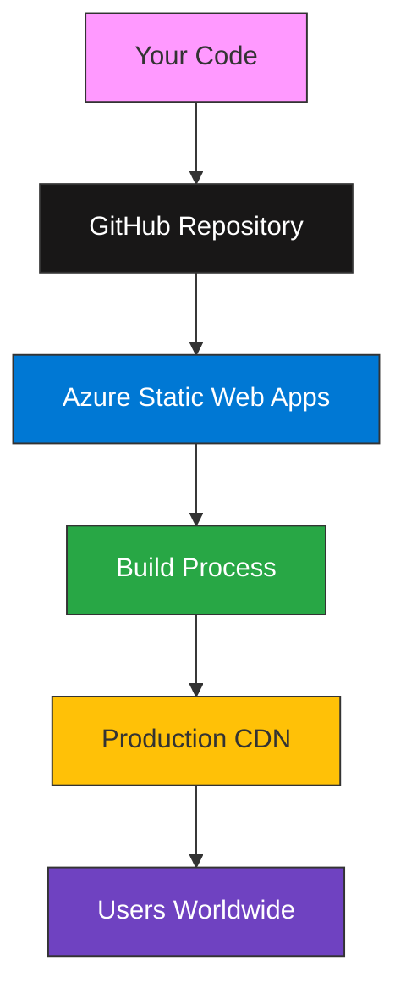
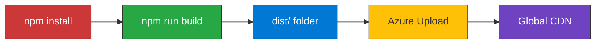
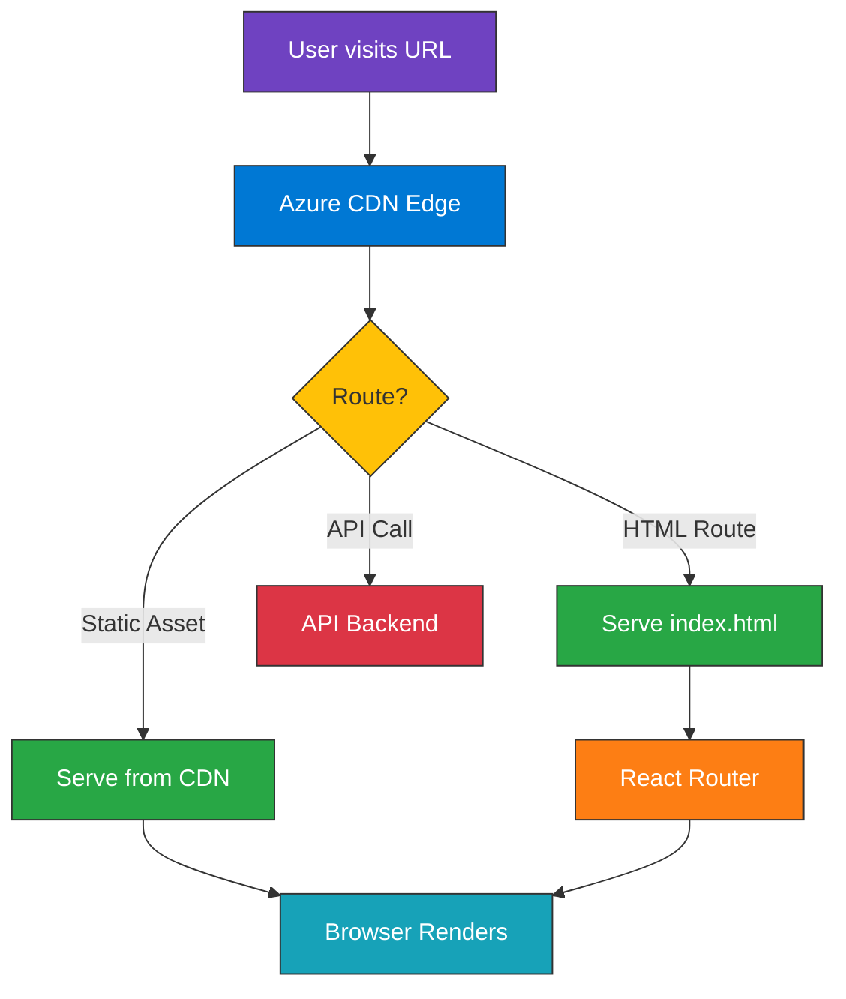
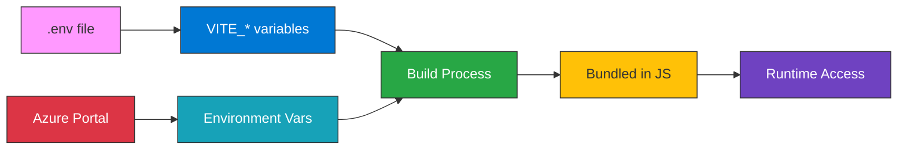
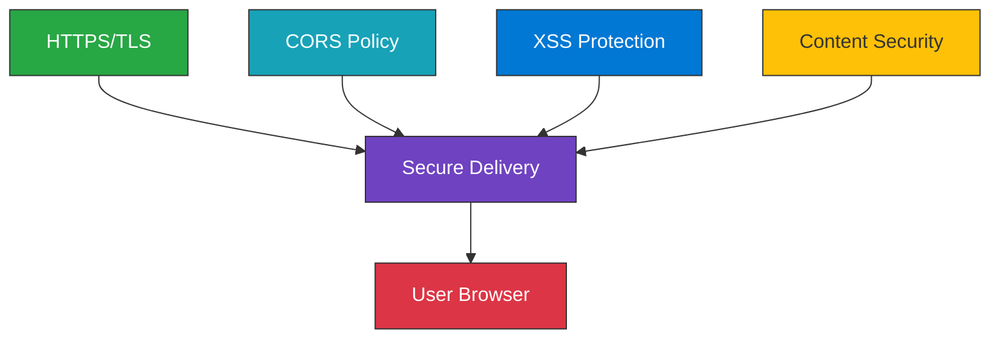

# Azure Static Web Apps Architecture

## Deployment Flow



## Build & Deploy Process



## File Structure After Build

```
portfolio-react/
├── src/                    # Source code
│   ├── components/        # React components
│   ├── services/          # API services
│   └── utils/             # Utility functions
├── dist/                  # Production build (deploy this!)
│   ├── index.html        # Main HTML
│   ├── 404.html          # Custom 404 page
│   └── assets/           # CSS & JS bundles
│       ├── index-*.css
│       └── index-*.js
├── azure-static-web-apps-config.yaml
├── .github/
│   └── workflows/
│       └── azure-static-web-apps.yml
└── package.json
```

## Request Flow in Production



## SPA Routing Configuration

```mermaid
graph TB
    A[/about] --> B{File Exists?}
    B -->|No| C[Rewrite to/index.html]
    C --> D[React Router Handles]
    B -->|Yes - 404.html| E[Show 404 Page]
    B -->|Yes - Asset| F[Serve Asset]
    
    style A fill:#0078D4,stroke:#333,color:#fff
    style B fill:#ffc107,stroke:#333
    style C fill:#28a745,stroke:#333,color:#fff
    style D fill:#6f42c1,stroke:#333,color:#fff
    style E fill:#dc3545,stroke:#333,color:#fff
    style F fill:#17a2b8,stroke:#333,color:#fff
```

## CI/CD Pipeline

```mermaid
graph LR
    A[Git Push] --> B[GitHub Actions]
    B --> C[Install Dependencies]
    C --> D[Run Lint]
    D --> E[Run Tests]
    E --> F[Build App]
    F --> G[Deploy to Azure]
    G --> H[Live Site]
    
    style A fill:#181717,stroke:#333,color:#fff
    style B fill:#28a745,stroke:#333,color:#fff
    style C fill:#0078D4,stroke:#333,color:#fff
    style D fill:#ffc107,stroke:#333
    style E fill:#17a2b8,stroke:#333,color:#fff
    style F fill:#6f42c1,stroke:#333,color:#fff
    style G fill:#dc3545,stroke:#333,color:#fff
    style H fill:#28a745,stroke:#333,color:#fff
```



## Environment Variables Flow



## Security Layers



## Global Distribution

```
User Requests → Azure Edge Locations → Your Content
                     ↓
              Cached at edge
                     ↓
              Fast delivery worldwide
```

**Benefits:**
- 🌍 Low latency globally
- ⚡ Fast load times
- 🔄 Automatic caching
- 📈 Scales automatically

---

This architecture ensures your portfolio is:
- ✅ Fast and performant
- ✅ Highly available
- ✅ Secure by default
- ✅ Globally distributed
- ✅ Easy to maintain
